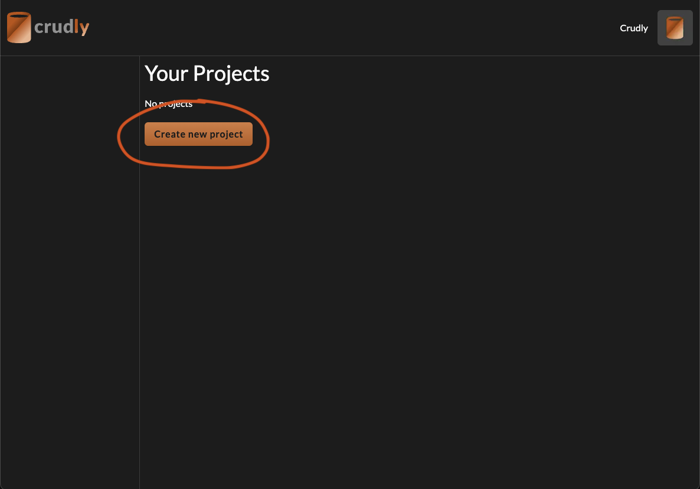
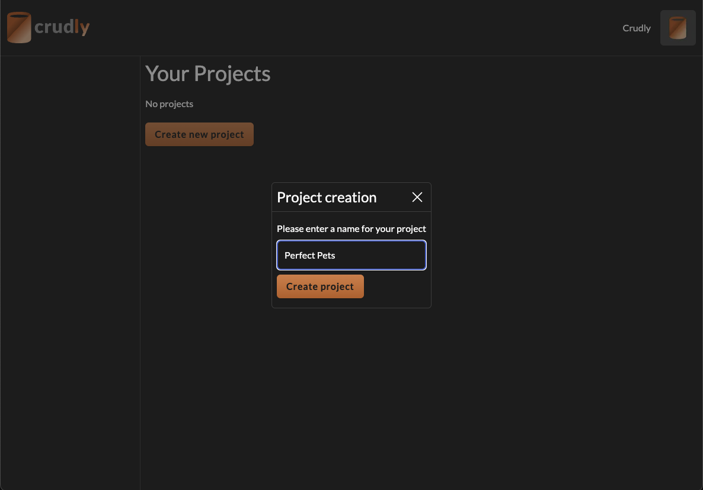
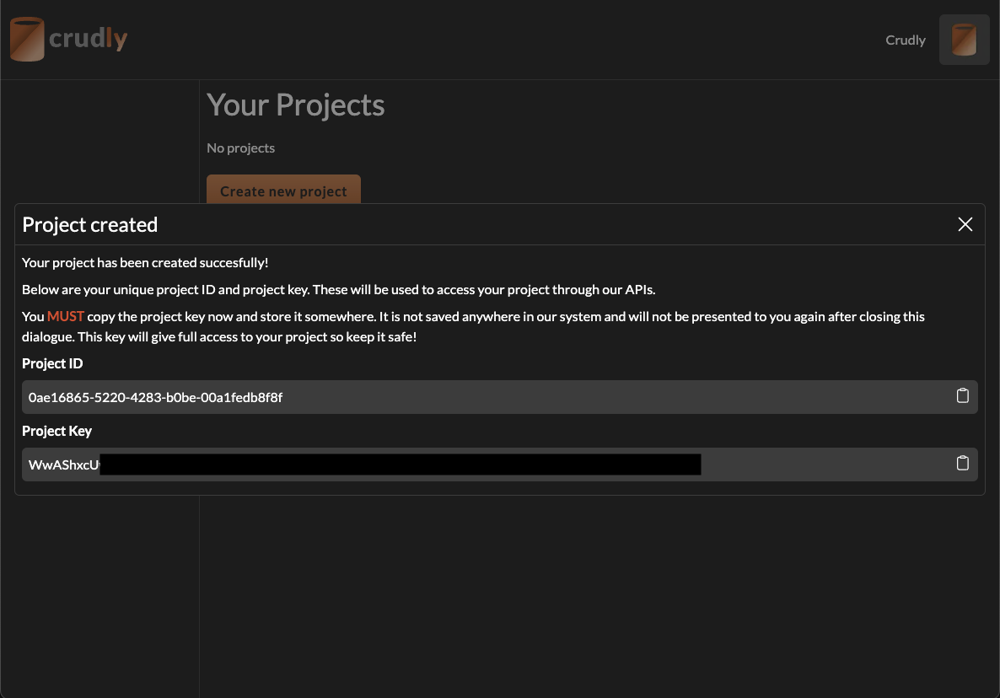
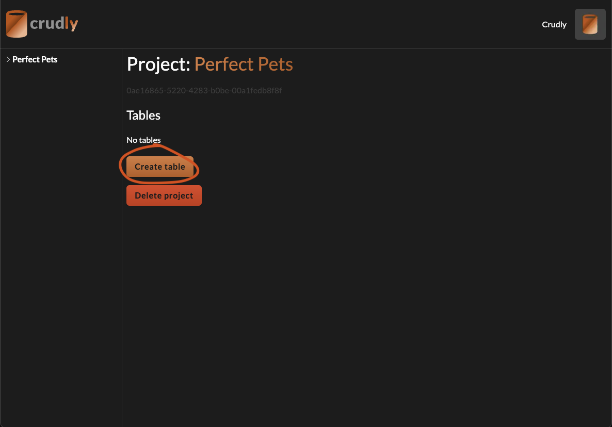
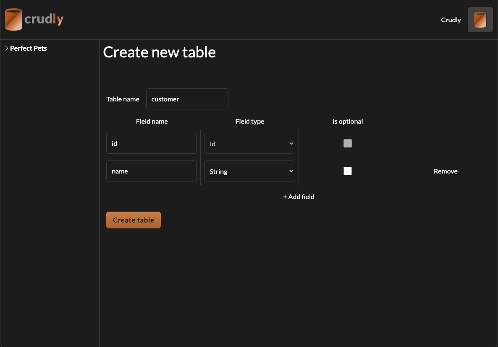
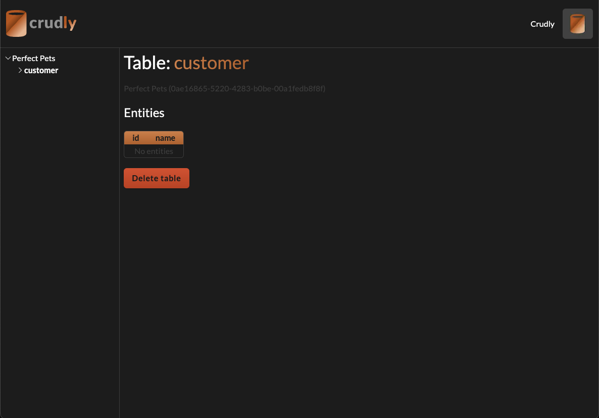
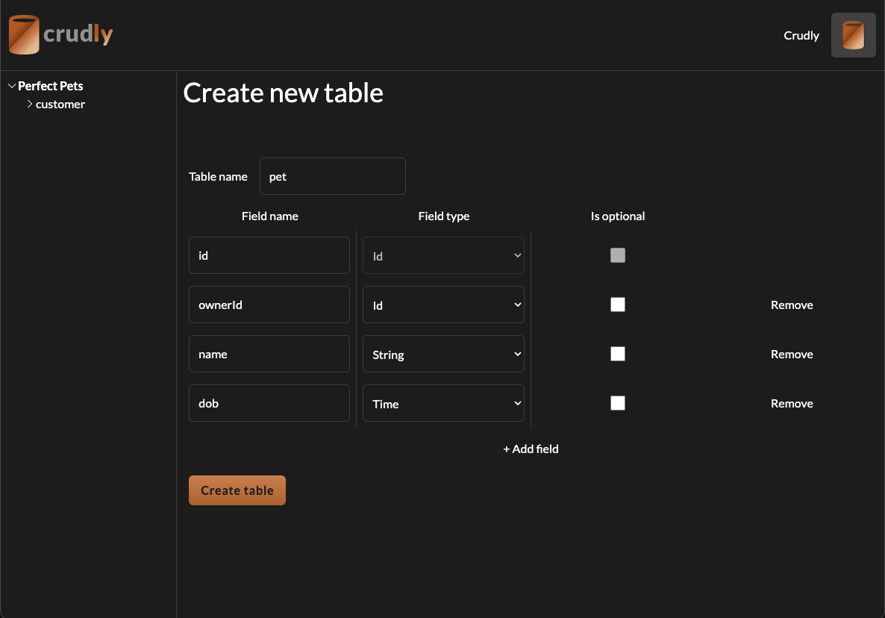
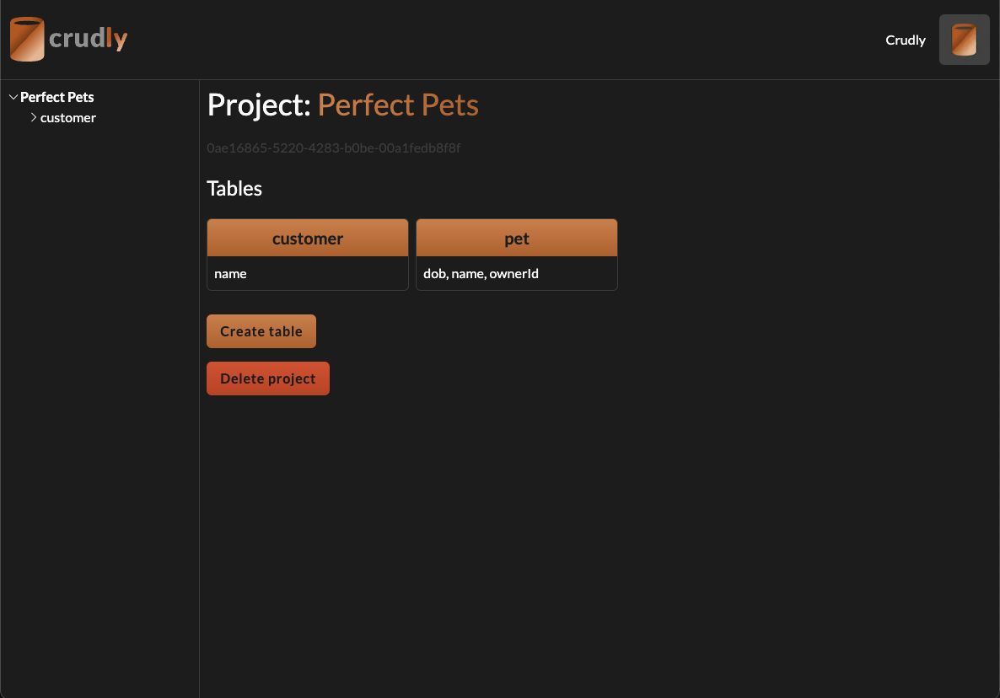

# Getting Started

The following guide will talk you through setting up your first project and table using the Crudly web application.

Note that the UI screenshots here could be subject to change, but the general process should remain the same. I will do my best to keep the screenshots up to date.

## Overview

We're going to setup a system for a pet grooming shop called "Perfect Pets". We'll need to store details for both the pets and their owners.

## Creating the Project

We'll start by creating a project called "Perfect Pets":

As detailed in the popup, the project key and project ID MUST be kept somewhere securely. You will not be able to retrieve the project key again after closing this dialogue.

## Creating the tables

Now that we have a project, we can create our first table. We'll start with the "customer" table.

All Crudly tables come with an `id` field, so we can just add a field for the customer's name:

After completing this step we should see the `customer` table created successfully:

Let's go back to the project screen (by clicking "Perfect Pets" again on the left hand navbar) and create the `pet` table.

We'll add a field for pet's name, date of birth and an ID to link the pet to the customer that we'll call `ownerId`:

And navigating back to the project screen we should now see both tables present:

Now we've finished creating our tables we are ready to start using them in our applications!
