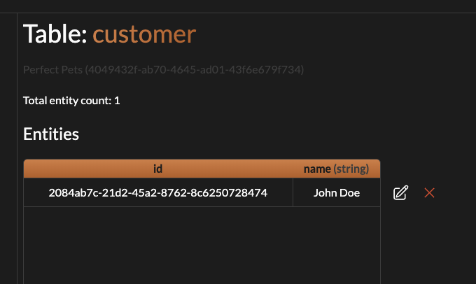

# Getting Started

## Pre-requisites

Before you start, make sure you have followed the "Getting Started" guide for the web application: [Getting Started](<../Getting%20Started%20(Crudly%20Web).md>)

We'll be building off of the tables created in this guide.

## Overview

In this guide, we'll use the tables created for our Pet Grooming shop to host a simple API for a web application.

Note that you will find the full code of this guide in the [example](./example) folder.

## Setup

Let's start by creating a new NodeJS project with a basic `package.json`:

```bash
touch package.json
touch main.js
```

```json
// package.json
{
  "type": "module"
}
```

We'll install express to host the HTTP web server:

```bash
npm install express
```

And let's populate `main.js` with a basic express server. We'll add routes for getting customer, pet and a pet's owner alongside some routes for creating them:

```js
import express from "express";

const app = express();
app.use(express.json());

app.get("/pet/:id", async (req, res) => {
  // TODO
});

app.get("/customer/:id", async (req, res) => {
  // TODO
});

app.get("/pet/:id/owner", async (req, res) => {
  // TODO
});

app.post("/pet", async (req, res) => {
  // TODO
});

app.post("/customer", async (req, res) => {
  // TODO
});

app.listen(3000);
```

## Working with Crudly

Start by installing the [Crudly NPM package](https://www.npmjs.com/package/@crudly/crudly):

```bash
npm install @crudly/crudly
```

Then let's import the package and initialise a Crudly object:

```js
import { createCrudly } from "@crudly/crudly";

const crudly = createCrudly({
  projectId: "<YOUR_PROJECT_ID>",
  projectKey: "<YOUR_PROJECT_KEY>",
});
```

Replace `<YOUR_PROJECT_ID>` and `<YOUR_PROJECT_KEY>` with the project ID and project key respectively that you should have obtained from the previous guide.

Now let's start interacting with our tables!

# POST endpoints

Let's start with the create pet endpoint:

```js
app.post("/pet", async (req, res) => {
  const petId = await crudly.createEntity("pet", req.body);
  res.json(petId);
});
```

And the create customer endpoint:

```js
app.post("/customer", async (req, res) => {
  const customerId = await crudly.createEntity("customer", req.body);
  res.json(customerId);
});
```

Let's give it a try! We'll run the server with `node main.js` and use curl to send a POST request to the customer creation endpoint:

```bash
curl -X POST -H "Content-Type: application/json" -d '{"name": "John Doe"}' http://localhost:3000/customer
```

We should get the customer ID back in the response. If we now go to check the `customer` table in the Crudly web app, we should find our new customer!



And now let's create a pet for this customer:

```bash
curl -X POST -H "Content-Type: application/json" -d '{"ownerId":"<OWNER ID>","name":"Cookie","dob":"2021-10-13T00:00:00Z"}' http://localhost:3000/pet
```

Make sure to replace `<OWNER ID>` with the customer ID you received in the previous request.

We should also now see our pet in the `pet` table:


# GET endpoints

We'll start with the get pet endpoint:

```js
app.get("/pet/:id", async (req, res) => {
  const pet = await crudly.getEntityById("pet", req.params.id);

  if (!pet) {
    return res.sendStatus(404);
  }

  res.json(pet);
});
```

It's as simple as that! We simplify specify which table we want to fetch from (the `pet` table) and the ID of the entity we want to fetch. Note that a `null` from this function implies no entity was found with that ID. Let's do the same for the customer endpoint:

```js
app.get("/customer/:id", async (req, res) => {
  const customer = await crudly.getEntityById("customer", req.params.id);

  if (!customer) {
    return res.sendStatus(404);
  }

  res.json(customer);
});
```

Now let's do the final more involved endpoint, getting a pet's owner:

```js
app.get("/pet/:id/owner", async (req, res) => {
  const pet = await crudly.getEntityById("pet", req.params.id);

  if (!pet) {
    return res.sendStatus(404);
  }

  const owner = await crudly.getEntityById("customer", pet.ownerId);

  if (!owner) {
    return res.sendStatus(500);
  }

  res.json(owner);
});
```

We'll return a 404 if we can't find the pet, since the pet ID is a path parameter. We'll return a 500 if the pet's owner can't be found. And that's all the endpoints implemented!

Let's give it a quick try with:

```bash
curl localhost:3000/pet/<PET ID>/owner
```

Replace `<PET ID>` with the ID of your pet and you should see the pet's owner returned in the response.

## Further Reading

To learn more check out the [full API reference for NodeJS](./README.md)
